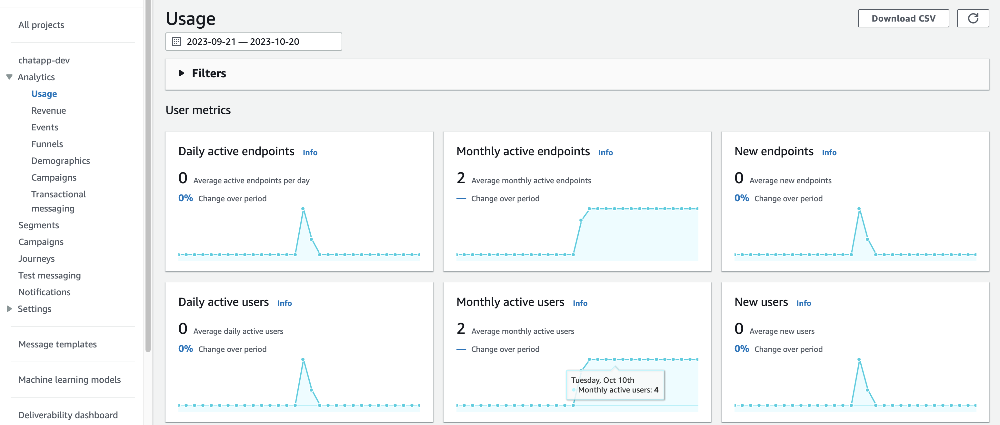

[[English](README.md)] [[한국어](README.ko.md)]

# Amplified Amazon Analytics (A3)
Amplified Amazon Analytics(A3)는 디지털 마케팅을 위한 솔루션입니다. 웹과 앱에서 고객 행동을 분석하고 마케팅 전략을 수립하여 시장을 읽고 사용자 행동 분석을 통해 주요 비즈니스 의사 결정을 내릴 수 있도록 도와줍니다. 또한 AWS의 주요 서비스와 쉽게 통합되어 분석 및 머신러닝(ML) 에코시스템으로 확장할 수 있습니다. 우선, AWS Amplify를 사용하면 웹과 앱에서 사용자 행동을 쉽게 추적할 수 있으며, Amazon Pinpoint 및 Amazon Kinesis와 통합하여 메트릭을 분석하고, 대시보드를 생성하고, 캠페인을 관리할 수 있습니다. 머신 러닝 및 광고 최적화와 같은 고급 기능이 필요한 경우, 행동 로그를 추출하여 SQL 기반 분석 및 머신 러닝을 수행하기 위해 Amazon Redshift로 확장할 수 있습니다. 더 많은 대시보드 기능이 필요한 경우, Amazon QuickSight를 연결하여 실시간 시각화를 구현할 수도 있습니다.

## ChatApp
ChatApp is a sample application to show how A3 works for digital marketing platform. This chat application is a react web app with [Cloudscape](https://cloudscape.design/) which is a prebuilt web-ui compoments for rapid development and AWS Amplify and AWS serverless services, such as AWS Cognito, AWS AppSync, Amazon DynamoDB.

**Application**\


**Analytics Dashboard**\



## Getting Started
### Clone repo
Download exmaple:
```
git clone git@github.com:Young-ook/chatapp.git
```
And change directory to the project source
```
cd chatapp
```

### Install React packages
To run the application, you must install reactstrap and npm dependencies on your workspace.\
Run npm-install command to download and install packages:
```
npm install reactstrap
```
You can try to use 'force' options to install packages and dependencies, if you see error.
```
npm install reactstrap --force
```

### Install Amplify CLI
The Amplify command-iine interface (CLI) is a unified toolchain to create AWS cloud services for your app. To install the amplify-cli on your workspace, vist the [developer guide](https://docs.amplify.aws/cli/start/install/) and follow the instructions.

**macOS**
```
brew install node
npm install -g @aws-amplify/cli
```

### Initialize an Amplify application
You can start to build an application from scratch using amplify-cli `init` command.\
Run command:
```
amplify init
```
(Optional),Create amplify environment.
```
amplify env list
amplify env add dev
amplify env checkout dev
```
### Add an Identity and Access Management service
```
amplify auth add
> Cognito User Pool
> Default configuration
> Username
```

### Add a GraphQL API service
```
amplify api add
> Change the auth mode config to Cognito User Pool
> Blank Schema
```
[Important] You must replace the auto-generated graphql.schema file by amplify-cli in the previous step with pre-defined model schema to run this example porperly.
Copy the graphql.scheam file under the src/graphql directory in your project directory, cloned local repository.
```
cp src/graphql/schema.graphql amplify/backend/api/chatapp/graphql.schema
```
Then, update the api configuration using amplify-cli. You can see an update on your local server configuration. 
```
amplify api update
```

### Add Analytics platform
```
amplify add analytics
> Amazon Pinpoint
```

### Apply changes
And apply changes on your AWS environment. Thia step will create your backend infrastructure on your AWS account such as Amazon Cognito (Auth), AWS AppSync (API), and Amazon DynamoDB (Database).
```
amplify push
```

### Open Analytics Dashboard
Once we have created the resources, we can run this command to open the Amazon Pinpoint console. Initially, all charts should be empty:
```
amplify console analytics
```

## Additional Resources
- [Amplify CLI enables creating Amazon Cognito User Pool Groups, configuring fine-grained permissions on groups, and adding user management capabilities to applications](https://aws.amazon.com/ko/blogs/mobile/amplify-cli-enables-creating-amazon-cognito-user-pool-groups-configuring-fine-grained-permissions-on-groups-and-adding-user-management-capabilities-to-applications/)
- [Amplify UI Troubleshooting](https://ui.docs.amplify.aws/react/getting-started/troubleshooting)
- [Amplify Analytics Automatic tracking](https://docs.amplify.aws/lib/analytics/autotrack/q/platform/js/)
