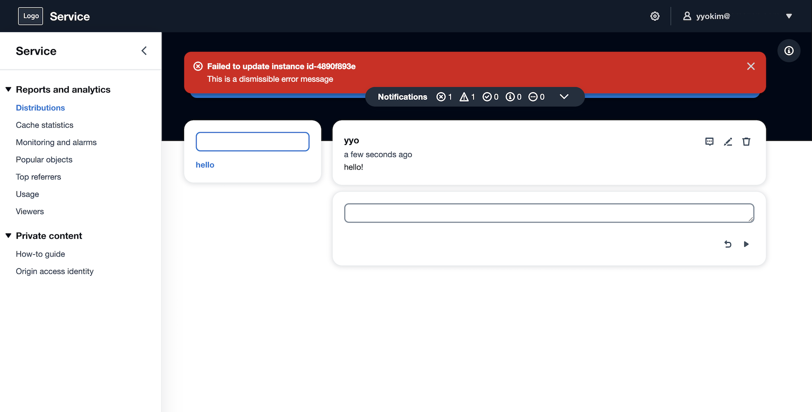
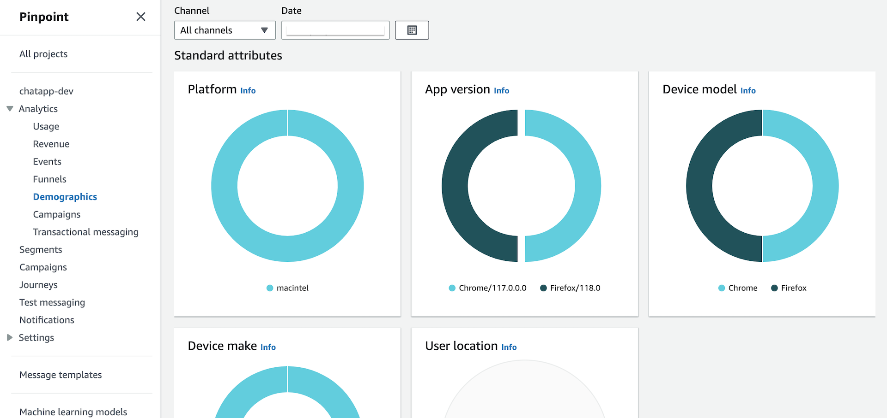

# ChatApp
This is an chat application example shows how to build rapidly a react web app with [Cloudscape](https://cloudscape.design/) and AWS Amplify and AWS serverless services, such as AWS Cognito, AWS AppSync, Amazon DynamoDB.

**Application**\


**Analytics Dashboard**\


## Getting Started
### Clone repo
Download exmaple:
```
git clone git@github.com:Young-ook/chatapp.git
```
And change directory to the project source
```
cd chatapp
```

### Install React packages
To run the application, you must install reactstrap and npm dependencies on your workspace.\
Run npm-install command to download and install packages:
```
npm install reactstrap
```
You can try to use 'force' options to install packages and dependencies, if you see error.
```
npm install reactstrap --force
```

### Install Amplify CLI
The Amplify command-iine interface (CLI) is a unified toolchain to create AWS cloud services for your app. To install the amplify-cli on your workspace, vist the [developer guide](https://docs.amplify.aws/cli/start/install/) and follow the instructions.

**macOS**
```
brew install node
npm install -g @aws-amplify/cli
```

### Initialize an Amplify application
You can start to build an application from scratch using amplify-cli `init` command.\
Run command:
```
amplify init
```
(Optional),Create amplify environment.
```
amplify env list
amplify env add dev
amplify env checkout dev
```
### Add an Identity and Access Management service
```
amplify auth add
> Cognito User Pool
> Default configuration
> Username
```

### Add a GraphQL API service
```
amplify api add
> Change the auth mode config to Cognito User Pool
> Blank Schema
```
[Important] You must replace the auto-generated graphql.schema file by amplify-cli in the previous step with pre-defined model schema to run this example porperly.
Copy the graphql.scheam file under the src/graphql directory in your project directory, cloned local repository.
```
cp src/graphql/schema.graphql amplify/backend/api/chatapp/graphql.schema
```
Then, update the api configuration using amplify-cli. You can see an update on your local server configuration. 
```
amplify api update
```

### Add Analytics platform
```
amplify add analytics
> Amazon Pinpoint
```

### Apply changes
And apply changes on your AWS environment. Thia step will create your backend infrastructure on your AWS account such as Amazon Cognito (Auth), AWS AppSync (API), and Amazon DynamoDB (Database).
```
amplify push
```

## Additional Resources
- [Amplify CLI enables creating Amazon Cognito User Pool Groups, configuring fine-grained permissions on groups, and adding user management capabilities to applications](https://aws.amazon.com/ko/blogs/mobile/amplify-cli-enables-creating-amazon-cognito-user-pool-groups-configuring-fine-grained-permissions-on-groups-and-adding-user-management-capabilities-to-applications/)
- [Amplify UI Troubleshooting](https://ui.docs.amplify.aws/react/getting-started/troubleshooting)
